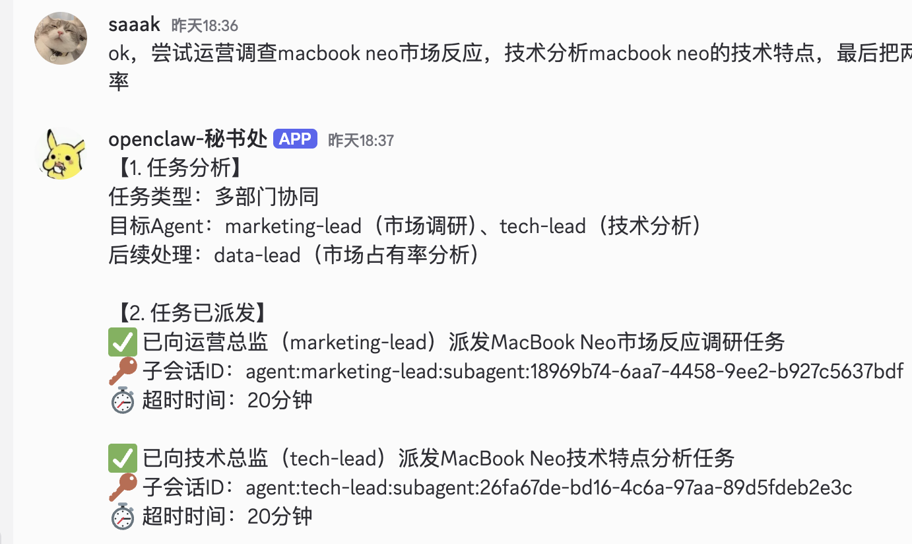
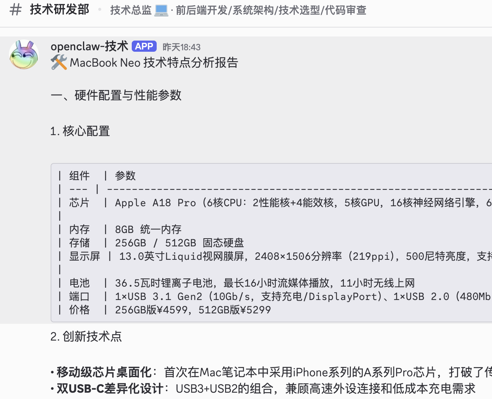

# [OpenClaw] Discord 多智能体模板

[English](README.md) | [简体中文](README.zh-CN.md)

这个目录是一个**与角色无关**的模板，用于在聊天平台上运行 **OpenClaw 多智能体部署**（这里以 Discord 作为示例）。

它将现有 OpenClaw 方案中的核心协作模式提炼为可复用的“技能风格”规范与配置流程。

## 可复制提示词（推荐）

### 给人工使用

将下面提示词复制给你的 LLM 智能体（Claude Code、AmpCode、Cursor 等）：

```
You are setting up an OpenClaw multi-agent deployment using this GitHub repository:
https://github.com/saaak/openclaw-discord-multiAgent

Fetch ONLY these docs (do not clone/download the whole repository):
- https://raw.githubusercontent.com/saaak/openclaw-discord-multiAgent/main/docs/CONFIGURATION_FLOW.md
- https://raw.githubusercontent.com/saaak/openclaw-discord-multiAgent/main/docs/AGENT_COLLABORATION_PROTOCOL.md

Then generate or update openclaw.json based on templates/openclaw.json.
Use only values I explicitly provide: LLM baseUrl+apiKey, Discord bot token(s), guildId, channel IDs, (optional) allowlist user IDs.
Do NOT invent/hallucinate any configuration values. For missing required values, keep placeholders like <REQUIRED_VALUE> and list what is missing.
If an existing openclaw.json is present, modify it in place with minimal changes; do NOT overwrite unrelated existing settings.
Do NOT hard-code any additional IDs, and do NOT include secrets in committed files.
Finally, output a short validation checklist to confirm routing + specialist publishing works.
```

### 给 LLM 智能体

打开并遵循本地指南：

- `docs/CONFIGURATION_FLOW.md`

## 你将获得

- `SKILL.md` —— 通用、可复用的多智能体协作“技能”（适用于公司、社群、虚构组织等）。
- `docs/CONFIGURATION_FLOW.md` —— 使用最少必填输入完成配置的分步指南（tokens、guild/channel IDs、allowlists）。
- `docs/AGENT_COLLABORATION_PROTOCOL.md` —— 路由与交接协议（spawn vs send、callback、结果发布）。
- `templates/openclaw.json` —— 已脱敏的 OpenClaw 配置模板（占位符形式）。
- `templates/credentials/*.json` —— allowlist 模板。
- `templates/workspaces/**/AGENTS.md` —— 与角色无关的智能体指令模板。

## 协作能力

- 支持 **agent 之间互相唤起**，用于专家智能体协同接力。
- 支持由协调者向专家智能体 **派发任务**。
- 支持由统一协调者 agent 对多路结果进行 **汇总后统一输出**。

## 效果展示

### 派发指令



### 响应指令



## 你需要提供的最小输入

1. **LLM 提供商配置**（base URL + API key）或本地模型端点。
2. **Discord Bot Tokens**
   - 方案 A：1 个 token（单 bot，通过 bindings 路由多智能体）
   - 方案 B：N 个 token（每个智能体一个 bot 账号，更利于清晰的“消息作者身份”）
3. **Discord IDs**：guild/server ID + channel IDs。
4. 可选：**allowlist 用户 IDs**（私有部署建议开启）。

## 安全说明

- **不要**提交 token 或 API key。
- 如果怀疑凭据泄露，请立即轮换 token。

---

从这里开始：`docs/CONFIGURATION_FLOW.md`。
